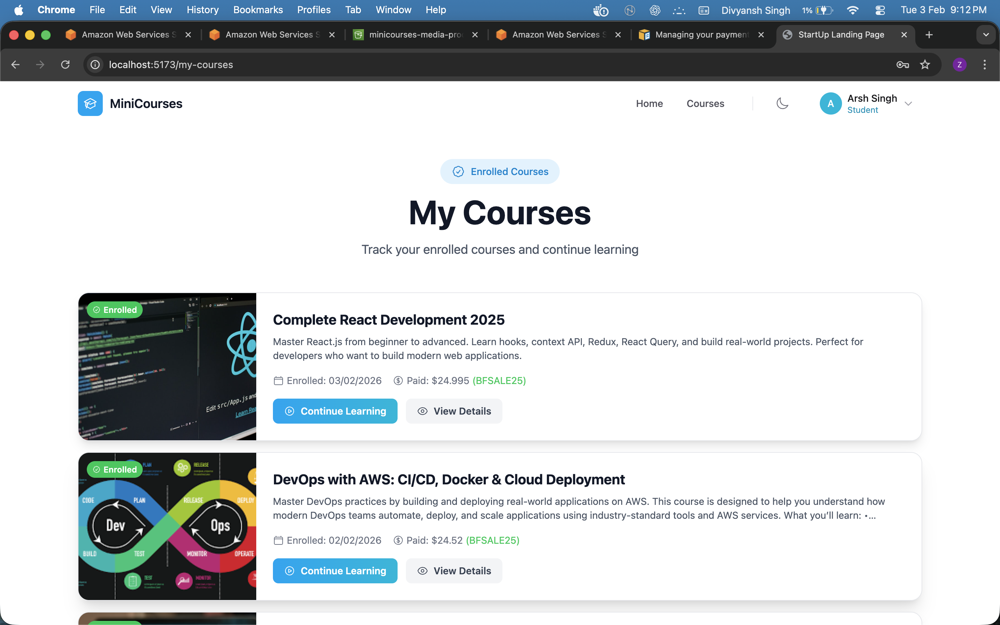

# MiniCourses — Complete Architecture & How Everything Works

This document explains the full architecture, data flows, UI screens, and all APIs (with Postman references). The main project overview stays in **README.md**; this file is the detailed reference.

---

## Table of Contents

1. [Architecture Overview](#1-architecture-overview)
2. [How Everything Works](#2-how-everything-works)
3. [Application Screenshots](#3-application-screenshots)
4. [All APIs & Postman Screenshots](#4-all-apis--postman-screenshots)
5. [APIs Without Postman Screenshot Yet](#5-apis-without-postman-screenshot-yet)

---

## 1. Architecture Overview

### High-level flow

- **Frontend (React, Vite)** runs at `localhost:5173` (dev) or your deployed URL. It uses a single API base URL (e.g. `http://localhost:4000/api` in dev).
- **Backend (Node.js, Express)** runs at `localhost:4000` (dev). It exposes REST APIs under `/api/*`, validates JWT for protected routes, and talks to MongoDB and (optionally) S3/CloudFront.
- **MongoDB** stores users, courses, course content, and subscriptions.
- **File storage**: development uses local `uploads/`; production can use **AWS S3 + CloudFront** for images/videos/documents.

### Role-based access

- **Teacher**: Can create/edit/delete courses, add/edit/delete content, upload files, view dashboard (courses, students, revenue). Cannot subscribe to courses.
- **Student**: Can browse courses, subscribe (with optional promo), view “My Courses,” and access content for enrolled courses. Can unsubscribe only from free courses.
- **Guest**: Can only browse courses and course details; must log in to subscribe.

### Frontend → Backend

- All API calls go through `frontend/src/services/api.js`.
- Base URL is `import.meta.env.VITE_API_URL` or `http://localhost:4000/api`.
- Protected requests send header: `Authorization: Bearer <token>` (token from login/register, stored in `localStorage`).
- Auth state and role are in `AuthContext`; route guards (`ProtectedRoute`, `TeacherRoute`, `StudentRoute`) enforce who can see which pages.

---

## 2. How Everything Works

### 2.1 Authentication flow

1. User opens **Login** or **Register**.
2. Frontend calls `POST /api/auth/register` or `POST /api/auth/login` with email/password (and name/role for register).
3. Backend validates, creates/finds user, returns `{ user, token }`.
4. Frontend stores `token` and `user` in `localStorage` and sets AuthContext.
5. All later API calls include `Authorization: Bearer <token>`.
6. For protected routes, backend middleware verifies JWT and attaches `req.user` (role: `teacher` | `student`).

### 2.2 Teacher: Create course

1. Teacher goes to **Dashboard** → “Create Course” (or `/add-course`).
2. Fills **Course Title**, **Description**, **Price (USD)**, and optional **Thumbnail** (URL or upload).
3. Thumbnail upload: frontend calls `POST /api/upload/file` with `FormData`; backend returns a URL (local or CloudFront).
4. Submit: frontend calls `POST /api/courses` with `{ title, description, price, thumbnail }`.
5. Backend creates course with `instructor = req.user._id`, returns the course. Teacher is redirected (e.g. to course list).

### 2.3 Teacher: Manage course content

1. From Dashboard, teacher clicks a course → **Manage** → `/course-manage/:id`.
2. Frontend loads course with `GET /api/courses/:id` and content with `GET /api/content/course/:courseId` (teacher is owner, so allowed).
3. “Add Content” opens a form: type (video/document/note/link), title, description, and URL or file. File upload again uses `POST /api/upload/file`.
4. Create: `POST /api/content` with `courseId`, `title`, `type`, and optional `videoUrl`/`fileUrl`/`textContent`/`externalLink`.
5. Edit: `PUT /api/content/:id`. Delete: `DELETE /api/content/:id`.

### 2.4 Student: Browse and subscribe (with promo)

1. Student opens **Courses** (`/courses`) or **Landing** and sees course list from `GET /api/courses` (published only).
2. Clicks a course → **Course Detail** (`/courses/:id`). Frontend loads `GET /api/courses/:id` and, if logged in, `GET /api/subscribe/check/:courseId` to see if already enrolled.
3. If course is paid, student can enter a promo (e.g. `BFSALE25`) and click Apply. Frontend calls `POST /api/subscribe/validate-promo` with `{ promoCode }`; backend returns discount info.
4. Price is shown as original, discount, and final. “Subscribe” may go to **Checkout** (`/courses/:id/checkout`) for paid, or directly call subscribe for free.
5. Checkout (dummy payment) or direct subscribe: frontend calls `POST /api/subscribe` with `{ courseId, promoCode }`. Backend creates subscription and returns success.
6. Student is then able to open **My Courses** and **Course Content** for that course.

### 2.5 Student: My Courses and course content

1. **My Courses** (`/my-courses`): frontend calls `GET /api/subscribe/my-courses`. Backend returns subscriptions with populated course info. List shows “Continue Learning” and “View Details.”
2. “Continue Learning” → `/course/:courseId/content`. Frontend loads `GET /api/content/course/:courseId` (allowed because student is enrolled). Renders sidebar (lessons) and main area (video/document/note/link).
3. Unsubscribe (free only): frontend calls `DELETE /api/subscribe/:subscriptionId`. Backend checks ownership and that course is free, then deletes subscription.

### 2.6 Teacher dashboard

1. **Teacher Dashboard** (`/teacher-dashboard`): frontend calls `GET /api/courses/dashboard`.
2. Backend aggregates courses by `req.user._id`, subscriptions, revenue, and returns overview (total courses, students, subscriptions, revenue), per-course stats, and recent enrollments.
3. Frontend shows stats cards, “Your Courses,” and “Recent Enrollments” (or “Course Students” when one course is selected).

---

## 3. Application Screenshots

Below are the main UI screens and what they demonstrate.

### Landing page (all users)

- **Route:** `/`
- **What it does:** Hero, promo banner (e.g. Black Friday, BFSALE25), “Dashboard” / “Browse courses” (role-based), and stats (e.g. 20+ courses, 1.5k+ students, 4.8 rating).

---

### Teacher — Create new course

- **Route:** `/add-course`
- **What it does:** Form for Course Title, Description (0/1000), Price (USD), Thumbnail (URL or upload). “Back to Courses” and submit create a new course via API.

---

### Teacher — Course content management

- **Route:** `/course-manage/:id`
- **What it does:** Shows one course (e.g. “DevOps with AWS…”), “Add Content” button, and list of content items with view/edit/delete. Uses course and content APIs.

---

### Teacher — Dashboard

- **Route:** `/teacher-dashboard`
- **What it does:** Welcome, “Create Course,” stats (Total Courses, Total Students, Subscriptions, Total Revenue), “Your Courses” list with revenue per course, and “Recent Enrollments” (or Course Students when a course is selected). All from `GET /api/courses/dashboard`.

---

### Student — My Courses (enrolled list)

- **Route:** `/my-courses`
- **What it does:** “Enrolled Courses” list with thumbnails, titles, descriptions, enrollment date, price paid, promo used, “Continue Learning” and “View Details.” Data from `GET /api/subscribe/my-courses`.

---

### Student — Course content view (lesson)

- **Route:** `/course/:courseId/content` or `/course/:courseId/content/:contentId`
- **What it does:** Sidebar with course title and lesson list; main area with current lesson (e.g. video embed). Uses `GET /api/content/course/:courseId` and content URLs.

---

### Course detail + promo (student)

- **Route:** `/courses/:id`
- **What it does:** Course thumbnail, title, price, description; “Have a promo code?” with apply; shows original price, discount (e.g. 50%), final price; “Subscribe for $X.XX.” Uses `GET /api/courses/:id`, `POST /api/subscribe/validate-promo`, and later `POST /api/subscribe`.

---

## 4. All APIs & Postman Screenshots

Base URL (dev): `http://localhost:4000/api`  
Protected routes need header: `Authorization: Bearer <token>`.

### Auth

| Method | Endpoint | Description | Postman screenshot |
|--------|----------|-------------|--------------------|
| POST | `/api/auth/register` | Register (name, email, password, role) |  |
| POST | `/api/auth/login` | Login (email, password) |  |
| GET | `/api/auth/me` | Current user (protected) |  |

### Courses

| Method | Endpoint | Description | Postman screenshot |
|--------|----------|-------------|--------------------|
| GET | `/api/courses` | List published courses |  |
| POST | `/api/courses` | Create course (teacher) |  |
| GET | `/api/courses/:id` | Get one course | *(add screenshot)* |
| PUT | `/api/courses/:id` | Update course (teacher, owner) | *(add screenshot)* |
| DELETE | `/api/courses/:id` | Delete course (teacher, owner) | *(add screenshot)* |
| GET | `/api/courses/my-created-courses` | Teacher’s courses | *(add screenshot)* |
| GET | `/api/courses/dashboard` | Teacher dashboard stats | *(add screenshot)* |

### Subscriptions

| Method | Endpoint | Description | Postman screenshot |
|--------|----------|-------------|--------------------|
| POST | `/api/subscribe` | Subscribe to course (body: courseId, promoCode) |  |
| GET | `/api/subscribe/my-courses` | My enrolled courses |  |
| GET | `/api/subscribe/check/:courseId` | Check if subscribed | *(add screenshot)* |
| DELETE | `/api/subscribe/:subscriptionId` | Unsubscribe (free only) | *(add screenshot)* |
| POST | `/api/subscribe/validate-promo` | Validate promo (body: promoCode) |  |

### Content

| Method | Endpoint | Description | Postman screenshot |
|--------|----------|-------------|--------------------|
| GET | `/api/content/course/:courseId` | List content (enrolled or owner) | *(add screenshot)* |
| GET | `/api/content/:id` | Get one content item | *(add screenshot)* |
| POST | `/api/content` | Add content (teacher, owner) | *(add screenshot)* |
| PUT | `/api/content/:id` | Update content (teacher, owner) | *(add screenshot)* |
| DELETE | `/api/content/:id` | Delete content (teacher, owner) | *(add screenshot)* |

### Upload

| Method | Endpoint | Description | Postman screenshot |
|--------|----------|-------------|--------------------|
| POST | `/api/upload/file` | Upload one file (FormData, teacher) | *(add screenshot)* |
| POST | `/api/upload/multiple` | Upload multiple files (teacher) | *(add screenshot)* |
| DELETE | `/api/upload/file/:filename` | Delete file (teacher) | *(add screenshot)* |

### Health

| Method | Endpoint | Description | Postman screenshot |
|--------|----------|-------------|--------------------|
| GET | `/health` | Health check (no /api prefix; root of backend) | *(add screenshot)* |

---

## 5. APIs Without Postman Screenshot Yet

Add Postman screenshots for these and then paste them into the `apiss/` folder and link them in the table above (replace “*(add screenshot)*” with the image path). Suggested filenames:

- **Courses:**  
  `getapicoursebyid.png`, `putapicourse.png`, `deleteapicourse.png`, `getapimycreatedcourses.png`, `getapidashboard.png`
- **Subscriptions:**  
  `getapichecksubscription.png`, `deleteapisubscription.png`
- **Content:**  
  `getapicontentcourse.png`, `getapicontentbyid.png`, `postapicontent.png`, `putapicontent.png`, `deleteapicontent.png`
- **Upload:**  
  `postapiuploadfile.png`, `postapiuploadmultiple.png`, `deleteapiuploadfile.png`
- **Health:**  
  `gethealth.png`

After you add a screenshot, update the table in [Section 4](#4-all-apis--postman-screenshots) with the correct image path (e.g. `apiss/getapicoursebyid.png`).

---

*This document is the detailed architecture and API reference. For setup, env vars, and deployment, see **README.md**.*
