# MiniCourses — Course Subscription Platform

A full-stack SaaS application for creating, managing, and subscribing to online courses. Teachers create and manage courses with multimedia content; students browse, subscribe (with optional promo codes), and access course content. Built with React, Node.js, Express, and MongoDB, with role-based access control, JWT authentication, and optional AWS S3/CloudFront for file storage.

---

## Table of Contents

- [Overview](#overview)
- [Screenshots](#screenshots)
- [Start to End: How the Application Runs](#start-to-end-how-the-application-runs)
- [Architecture](#architecture)
- [Complete Application Structure](#complete-application-structure)
- [All APIs — Complete Reference](#all-apis--complete-reference)
- [How Promo Codes Work (End-to-End)](#how-promo-codes-work-end-to-end)
- [How the Application Works](#how-the-application-works)
- [Tech Stack](#tech-stack)
- [Features](#features)
- [Getting Started](#getting-started)
- [Environment Variables](#environment-variables)
- [Deployment](#deployment)
- [License](#license)

---

## Overview

**MiniCourses** is a course subscription platform with two main user roles:

| Role      | Capabilities |
|-----------|--------------|
| **Teacher** | Create and publish courses, add content (video/document/note/link), upload thumbnails and files, view dashboard (courses, enrollments, revenue), manage course content. Cannot subscribe to courses. |
| **Student** | Browse published courses, view course details, apply promo codes, subscribe (free or paid with dummy checkout), view "My Courses," access enrolled course content, unsubscribe from free courses only. |
| **Guest**  | Browse courses and course details only; must log in to subscribe. |

The frontend is a single-page application (React + Vite) that talks to a REST API (Node.js + Express). Data is stored in MongoDB; file uploads use local storage in development and can use **AWS S3 + CloudFront** in production.

---

## Screenshots

### Landing page

Hero section with promo banner (Black Friday 50% off, code **BFSALE25**), role-based nav (Teacher: Dashboard; Student: Browse courses), and platform stats.


### Teacher — Create new course

Form for course title, description (0/1000), price (USD), and optional thumbnail. Route: `/add-course`.

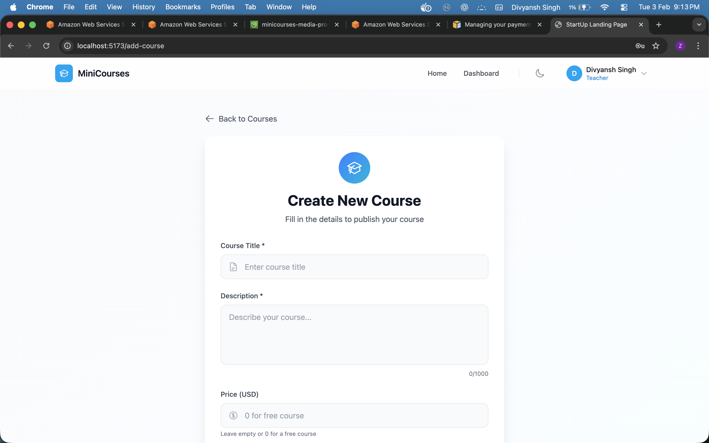

### Teacher — Course content management

Manage content for a course: add/edit/delete items (video, document, note, link). Route: `/course-manage/:id`.

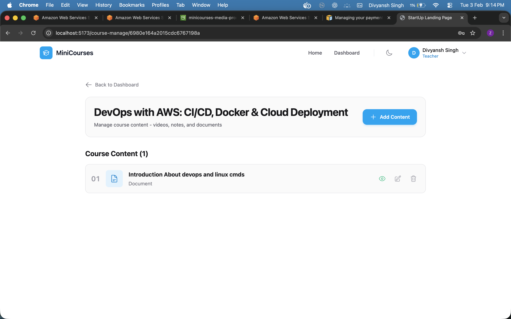

### Teacher — Dashboard

Overview: total courses, students, subscriptions, revenue; “Your Courses” with per-course stats; recent enrollments. Data from `GET /api/courses/dashboard`.

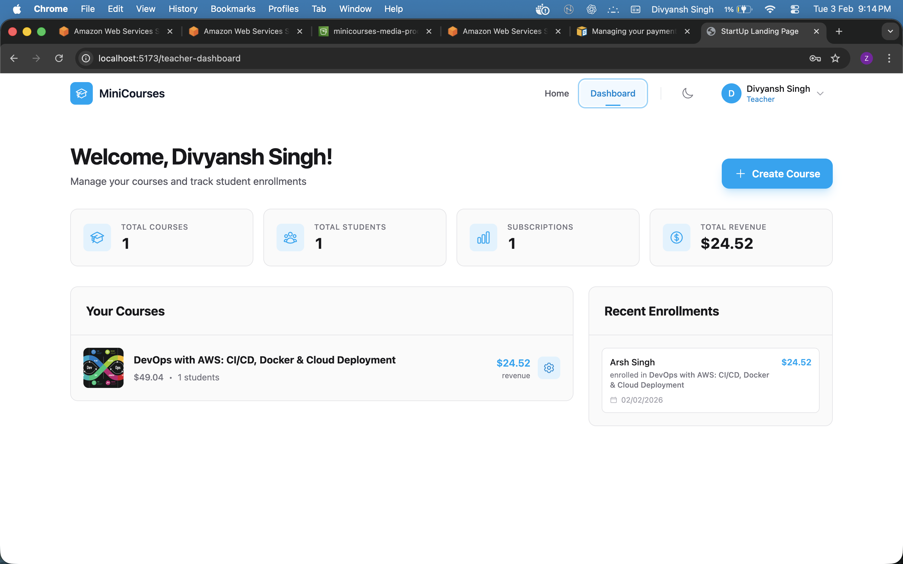

### Student — My Courses (enrolled list)

Enrolled courses with thumbnails, enrollment date, price paid, promo used (e.g. BFSALE25), “Continue Learning” and “View Details.” Route: `/my-courses`. Data from `GET /api/subscribe/my-courses`.


### Student — Course content view (lesson)

Sidebar with lesson list; main area with video/content. Route: `/course/:courseId/content`. Uses `GET /api/content/course/:courseId`.

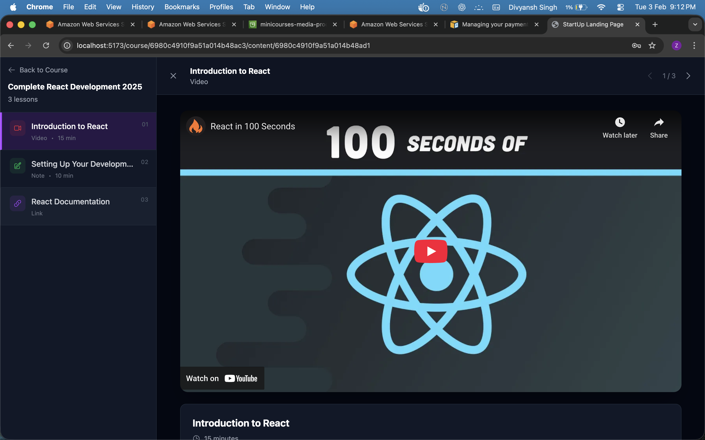

### Course detail with promo

Course info, “Have a promo code?” with apply; original price, discount (e.g. 50%), final price; “Subscribe for $X.XX.” Uses `POST /api/subscribe/validate-promo` and `POST /api/subscribe`.

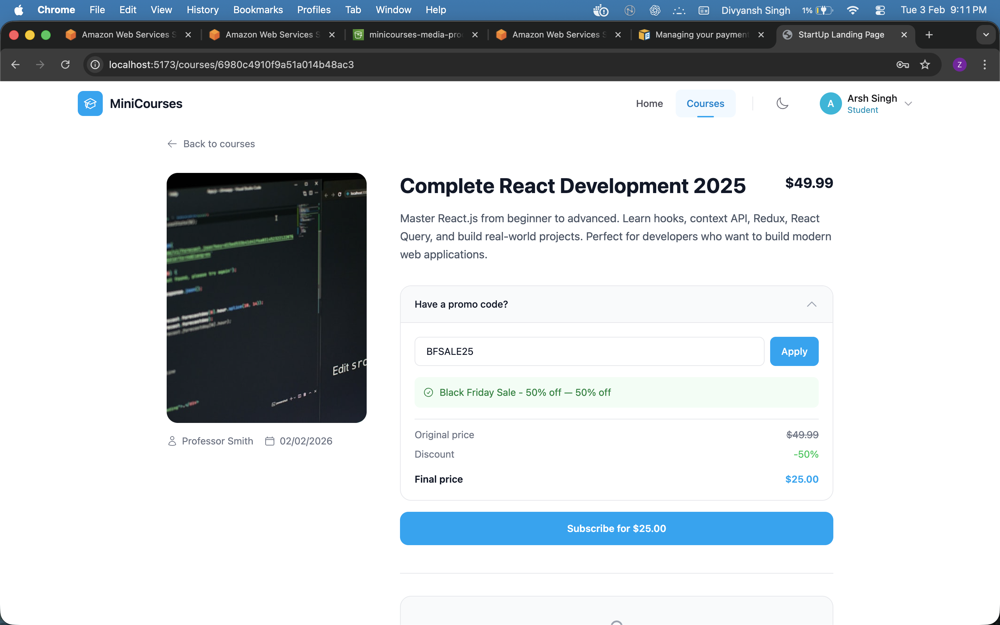

### API example — Create course (Postman)

`POST /api/courses` with JSON body (title, description, price, thumbnail). Response: `201 Created` with course object including `_id`, `instructor`, `isPublished`, timestamps.

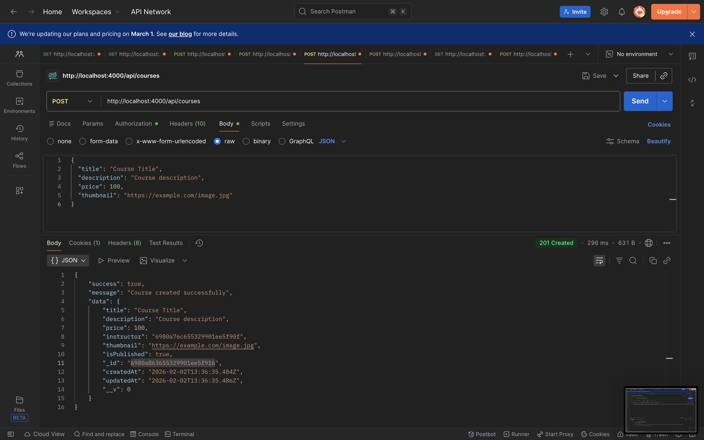

---

## Start to End: How the Application Runs

### Server startup (backend)

1. **Load env** — `load-env.js` loads `.env`; `server.js` runs.
2. **Validate env** — `validateEnv()` from `config/env.js` checks required variables (`MONGODB_URI`, `JWT_SECRET`, `JWT_EXPIRE`). Missing vars → exit with error.
3. **Middleware** — Helmet (security headers), CORS (allowed origins), rate limiting (general + stricter on auth), `express.json()`.
4. **Database** — `connectDB()` connects to MongoDB (async). Server still starts if DB fails (with warning).
5. **Routes** — Mounted under `/api/*`: auth, courses, subscribe, content, upload. Root `/` and `/health` at server root.
6. **Listen** — Server binds to `PORT` (default 4000). Logs mode, storage type, CORS origins.

### Frontend startup

1. **Vite** serves the app; `main.jsx` mounts React with `AuthProvider` and router.
2. **AuthContext** reads `localStorage` for token/user; if present, user is “logged in” and role is set.
3. **Routes** render based on path; protected/teacher/student routes check auth and role.

### From a user’s perspective (end-to-end)

| Step | What happens |
|------|----------------|
| **1. Open app** | User hits frontend URL (e.g. `http://localhost:5173`). Sees landing: hero, promo banner, “Browse courses,” login/register or role-based links. |
| **2. Browse** | `GET /api/courses` returns published courses. Course list and course detail (`GET /api/courses/:id`) work for everyone (guest/student/teacher). |
| **3. Auth** | Register: `POST /api/auth/register` (name, email, password, role). Login: `POST /api/auth/login` (email, password). Response: `{ user, token }`. Frontend stores token and user; navbar and routes update. |
| **4a. Teacher** | Dashboard: `GET /api/courses/dashboard`. Create course: `POST /api/courses`. Manage content: `GET/POST/PUT/DELETE /api/content/*`. Upload: `POST /api/upload/file`. |
| **4b. Student** | Course detail → optional promo: `POST /api/subscribe/validate-promo` → then Subscribe: `POST /api/subscribe` (courseId, optional promoCode). My Courses: `GET /api/subscribe/my-courses`. Content: `GET /api/content/course/:courseId`. Unsubscribe (free only): `DELETE /api/subscribe/:id`. |
| **5. Shutdown** | Backend: SIGTERM/SIGINT → `gracefulShutdown` → close HTTP server → close MongoDB → exit. Frontend: user closes tab or navigates away. |

### Summary

- **Start:** Env validation → DB connect → routes → server listen; frontend loads → auth from storage → route by path and role.
- **End:** User logs out or closes app; backend exits on signal with graceful shutdown.

---

## Architecture

### System Architecture (High-Level)

```
┌─────────────────────────────────────────────────────────────────────────┐
│                         FRONTEND (React + Vite)                          │
│                                                                         │
│   ┌─────────────┐  ┌─────────────┐  ┌─────────────┐  ┌─────────────┐  │
│   │   Public    │  │  Protected  │  │   Student   │  │   Teacher   │  │
│   │   Routes    │  │   Routes    │  │   Routes    │  │   Routes    │  │
│   │ /, /courses │  │  Checkout   │  │ /my-courses│  │ /teacher-   │  │
│   │ /login,     │  │  /course/   │  │             │  │  dashboard  │  │
│   │ /register   │  │  :id/content│  │             │  │ /add-course │  │
│   └──────┬──────┘  └──────┬──────┘  └──────┬──────┘  │ /course-   │  │
│          │                │                │          │  manage/:id │  │
│          └────────────────┼────────────────┼──────────┴──────┬──────┘  │
│                           │                │                 │         │
│                    ┌──────▼────────────────▼─────────────────▼──────┐  │
│                    │           AuthContext (JWT in localStorage)     │  │
│                    │           api.js (centralized API base URL)     │  │
│                    └──────────────────────┬────────────────────────┘  │
└────────────────────────────────────────────┼────────────────────────────┘
                                             │
                                             │  REST API (JSON)
                                             │  Authorization: Bearer <token>
                                             │
┌────────────────────────────────────────────▼────────────────────────────┐
│                         BACKEND (Node.js + Express)                       │
│                                                                         │
│   ┌─────────────────────────────────────────────────────────────────┐   │
│   │  Security: Helmet, CORS (allowed origins), Rate limiting         │   │
│   └─────────────────────────────────────────────────────────────────┘   │
│                                                                         │
│   ┌──────────┐ ┌──────────┐ ┌────────────┐ ┌──────────┐ ┌──────────┐     │
│   │ /api/    │ │ /api/    │ │ /api/      │ │ /api/    │ │ /api/    │     │
│   │ auth     │ │ courses  │ │ subscribe  │ │ content  │ │ upload   │     │
│   │ login,   │ │ CRUD,    │ │ subscribe, │ │ course/  │ │ file,    │     │
│   │ register,│ │ dashboard│ │ my-courses,│ │ :id,     │ │ multiple │     │
│   │ me       │ │ my-      │ │ check,     │ │ CRUD     │ │ delete   │     │
│   │          │ │ created  │ │ validate-  │ │          │ │          │     │
│   │          │ │          │ │ promo      │ │          │ │          │     │
│   └────┬─────┘ └────┬─────┘ └─────┬──────┘ └────┬─────┘ └────┬─────┘     │
│        │            │             │             │            │           │
│        └────────────┴─────────────┴──────┬──────┴────────────┴───────────┘
│                                          │
│   ┌─────────────────────────────────────▼─────────────────────────────┐   │
│   │  Auth Middleware: JWT verify → req.user (role: teacher | student)  │   │
│   └─────────────────────────────────────┬─────────────────────────────┘   │
└──────────────────────────────────────────┼─────────────────────────────────┘
                                           │
┌──────────────────────────────────────────▼─────────────────────────────────┐
│                           DATA LAYER                                        │
│                                                                             │
│   ┌────────────┐  ┌────────────┐  ┌──────────────┐  ┌──────────────┐       │
│   │   User     │  │   Course   │  │ Subscription │  │ CourseContent│       │
│   │   (Mongo)  │  │   (Mongo)  │  │   (Mongo)    │  │   (Mongo)    │       │
│   │ name,      │  │ title,     │  │ userId,      │  │ courseId,    │       │
│   │ email,     │  │ description│  │ courseId,    │  │ title, type, │       │
│   │ password,  │  │ price,     │  │ pricePaid,   │  │ videoUrl,    │       │
│   │ role       │  │ instructor │  │ promoCode   │  │ fileUrl, etc │       │
│   └────────────┘  └────────────┘  └──────────────┘  └──────────────┘       │
│                                          │                                 │
│   ┌─────────────────────────────────────▼─────────────────────────────┐   │
│   │                    MongoDB (Atlas or local)                         │   │
│   └────────────────────────────────────────────────────────────────────┘   │
│                                                                             │
│   ┌────────────────────────────────────────────────────────────────────┐   │
│   │  File Storage: Dev → uploads/ (local) | Prod → S3 + CloudFront     │   │
│   └────────────────────────────────────────────────────────────────────┘   │
└─────────────────────────────────────────────────────────────────────────────┘
```

### Data Flow Summary

1. **Authentication**  
   User registers or logs in → backend returns JWT and user object → frontend stores token and user in `localStorage` and `AuthContext` → every protected API request sends `Authorization: Bearer <token>` → backend middleware verifies JWT and sets `req.user` (including `role`).

2. **Teacher: Create course**  
   Teacher submits form (title, description, price, optional thumbnail) → optional thumbnail upload via `POST /api/upload/file` → `POST /api/courses` creates course with `instructor = req.user._id` → redirect to courses or dashboard.

3. **Teacher: Manage content**  
   Teacher opens course manage page → `GET /api/courses/:id` and `GET /api/content/course/:courseId` load course and content → add/edit/delete content via `POST /api/content`, `PUT /api/content/:id`, `DELETE /api/content/:id` → file uploads again use `POST /api/upload/file`.

4. **Student: Subscribe**  
   Student views course detail → `GET /api/courses/:id` and (if logged in) `GET /api/subscribe/check/:courseId` → optional promo: `POST /api/subscribe/validate-promo` → subscribe: `POST /api/subscribe` with `courseId` and optional `promoCode` → for paid courses, dummy checkout then same subscribe call.

5. **Student: My Courses & content**  
   My Courses page: `GET /api/subscribe/my-courses` → list of subscriptions with course info → "Continue Learning" opens course content view → `GET /api/content/course/:courseId` (allowed because student is enrolled) → render lessons (video/document/note/link).

6. **Teacher dashboard**  
   `GET /api/courses/dashboard` → backend aggregates courses by `req.user._id`, subscriptions, revenue → returns overview (totals) and per-course stats and recent enrollments → frontend displays stats cards, course list, and enrollment list.

### Frontend Component Architecture

```
App.jsx
├── ErrorBoundary
└── Router
    └── AuthProvider
        ├── Public: /, /courses, /courses/:id, /login, /register
        ├── Protected: /courses/:id/checkout, /course/:courseId/content
        ├── Student-only: /my-courses
        └── Teacher-only: /teacher-dashboard, /add-course, /course-manage/:id
        │
        └── Shared: Navbar (role-based links), Footer
```

- **Route guards:** `ProtectedRoute` (any logged-in user), `TeacherRoute` (role === teacher), `StudentRoute` (role === student). Unauthorized access redirects to login or home.
- **API layer:** All HTTP calls go through `frontend/src/services/api.js` using a single base URL (`VITE_API_URL` or `http://localhost:4000/api`). Auth header is attached automatically from `localStorage` token.

### Backend Layer Explanation

| Layer        | Purpose |
|-------------|---------|
| **Routes**  | Define HTTP endpoints; validate request body (e.g. express-validator); call business logic; return JSON. |
| **Middleware** | `protect`: verify JWT, load user into `req.user`. `authorize('teacher' | 'student')`: ensure `req.user.role` matches. |
| **Models**  | Mongoose schemas for User, Course, Subscription, CourseContent; define structure and validation. |
| **Config**  | `db.js`: MongoDB connection. `env.js`: validate required env vars on startup. |
| **Services**| `storage.js`: abstract file storage — local `uploads/` or S3 + CloudFront based on env. |

---

## How the Application Works

### Role-Based Behavior

- **Navbar & landing CTAs:** Teachers see "Dashboard" and "Browse courses"; students see "Browse courses" and (if logged in) "My courses"; guests see "Browse courses" and login/register.
- **Routes:** Teacher-only routes (`/teacher-dashboard`, `/add-course`, `/course-manage/:id`) return 403 or redirect if the user is not a teacher. Student-only routes (e.g. `/my-courses`) similarly enforce student role.
- **APIs:** Backend checks `req.user.role` where needed (e.g. teachers cannot subscribe; only course owner can update/delete course or content).

### Promo Codes (see [How Promo Codes Work](#how-promo-codes-work-end-to-end) for full flow)

- Backend holds a config of valid promo codes (e.g. `BFSALE25` with 50% discount). Student enters code on course detail page → frontend calls `POST /api/subscribe/validate-promo` → UI shows discounted price → on subscribe, same code is sent in `POST /api/subscribe` and backend applies discount to `pricePaid`.

### File Uploads

- **Development:** Files saved under backend `uploads/` (e.g. `uploads/images/`, `uploads/videos/`). API returns paths like `/uploads/images/...`; frontend can prepend backend origin if needed.
- **Production (optional):** If AWS credentials and S3/CloudFront are set, `storage.js` uploads to S3 and returns CloudFront URLs. Frontend treats URLs starting with `http` as absolute and does not prepend backend origin.

### Security

- **Backend:** Optional Helmet (security headers), CORS (configurable allowed origins), rate limiting (general + stricter on auth routes). JWT secret and expiry from env. Passwords hashed with bcrypt.
- **Frontend:** Token in `localStorage`; no sensitive data in client-side code. Protected routes and role checks both in UI and on API.

---

## How Promo Codes Work (End-to-End)

Promo codes apply a discount to **paid** courses. Free courses do not use promo codes.

### 1. Backend configuration

Promo codes are defined in the backend in `backend/src/routes/subscription.js`:

```js
const VALID_PROMO_CODES = {
  'BFSALE25': {
    discount: 0.5,   // 50% off
    description: 'Black Friday Sale - 50% off',
  },
  // Add more: 'SUMMER30': { discount: 0.3, description: '...' },
};
```

- **Key:** Promo code string (normalized to uppercase).
- **discount:** Fraction off (0.5 = 50%, 0.3 = 30%).
- **description:** Shown in UI when code is validated.

### 2. Validate promo (before checkout)

| Item | Value |
|------|--------|
| **Endpoint** | `POST /api/subscribe/validate-promo` |
| **Auth** | None (public) |
| **Body** | `{ "promoCode": "BFSALE25" }` |
| **Success (200)** | `{ "success": true, "message": "Valid promo code", "data": { "code": "BFSALE25", "discount": "50%", "description": "Black Friday Sale - 50% off" } }` |
| **Error (400)** | Invalid or missing code: `{ "success": false, "message": "Invalid promo code" }` |

The frontend uses this to show the discount and final price before the user subscribes.

### 3. Subscribe with promo

| Item | Value |
|------|--------|
| **Endpoint** | `POST /api/subscribe` |
| **Auth** | Required (Bearer token); **student only** (teachers get 403). |
| **Body** | `{ "courseId": "<courseId>", "promoCode": "BFSALE25" }` (promoCode optional for free courses) |
| **Backend logic** | Find course → reject if unpublished or own course → reject if already subscribed → **Free course:** `pricePaid = 0`, no promo required. **Paid course:** promo is **required**; look up code in `VALID_PROMO_CODES` → `pricePaid = course.price * (1 - discount)` → save subscription with `pricePaid` and `promoCodeUsed`. |
| **Success (201)** | `{ "success": true, "message": "Successfully subscribed to course", "data": { "subscriptionId", "courseId", "courseTitle", "originalPrice", "pricePaid", "discount", "promoCodeUsed", "subscribedAt" } }` |

So: **free courses** — no promo; **paid courses** — must send a valid promo code; backend applies the same config used in validate-promo.

### 4. Flow summary

1. Student opens course detail (paid course).
2. Enters promo code → frontend calls **validate-promo** → UI shows e.g. “50% off”, final price.
3. Student clicks Subscribe (after optional dummy checkout) → frontend calls **subscribe** with same `courseId` and `promoCode`.
4. Backend validates promo again, computes `pricePaid`, creates subscription with `promoCodeUsed`.
5. Student sees success and can go to “My Courses” and access content.

---

## Tech Stack

| Layer   | Technologies |
|---------|--------------|
| **Frontend** | React 19, Vite 7, React Router DOM 7, Tailwind CSS 4, Framer Motion, Heroicons |
| **Backend**  | Node.js, Express 4, Mongoose 8, JWT (jsonwebtoken), bcryptjs, express-validator, multer |
| **Database** | MongoDB (Atlas or local) |
| **Storage**  | Local `uploads/` or AWS S3 + CloudFront |
| **DevOps**   | Docker, Docker Compose (frontend + backend), Nginx (frontend in Docker) |

---

## Complete Application Structure

```
Starter copy/
├── frontend/
│   ├── public/
│   ├── src/
│   │   ├── components/     # Pages and UI components
│   │   │   ├── ui/         # Reusable UI (e.g. background-beams, globe)
│   │   │   ├── Hero.jsx, Navbar.jsx, Footer.jsx
│   │   │   ├── Login.jsx, Register.jsx
│   │   │   ├── Courses.jsx, CourseDetail.jsx, Checkout.jsx
│   │   │   ├── MyCourses.jsx, CourseContentView.jsx
│   │   │   ├── AddCourse.jsx, TeacherDashboard.jsx, CourseManage.jsx
│   │   │   ├── ProtectedRoute.jsx, TeacherRoute.jsx, StudentRoute.jsx
│   │   │   └── ErrorBoundary.jsx
│   │   ├── context/
│   │   │   └── AuthContext.jsx
│   │   ├── services/
│   │   │   └── api.js      # Centralized API (auth, courses, subscribe, content, upload)
│   │   ├── lib/
│   │   ├── App.jsx, main.jsx, index.css
│   │   └── ...
│   ├── index.html, package.json, vite.config.js
│   ├── Dockerfile, nginx.conf
│   └── .dockerignore
├── backend/
│   ├── src/
│   │   ├── config/
│   │   │   ├── db.js       # MongoDB connection
│   │   │   └── env.js      # Env validation
│   │   ├── middleware/
│   │   │   └── auth.js     # protect, authorize (teacher/student)
│   │   ├── models/
│   │   │   ├── User.js, Course.js, Subscription.js, CourseContent.js
│   │   ├── routes/
│   │   │   ├── auth.js, course.js, subscription.js, content.js, upload.js
│   │   └── services/
│   │       └── storage.js  # Local vs S3 upload/delete
│   ├── server.js, load-env.js, package.json
│   ├── Dockerfile
│   └── .dockerignore
├── docker-compose.yml      # backend + frontend services
├── README.md
└── .gitignore
```

---

## Features

- **Authentication:** Register (student/teacher), login, JWT, protected routes, role-based UI and API.
- **Courses:** CRUD for teachers; list published courses for everyone; course detail with instructor and price.
- **Subscriptions:** Subscribe (free or paid with promo); list "My Courses"; check subscription status; unsubscribe from free courses only.
- **Content:** Teachers add/edit/delete course content (video, document, note, link); students view content when enrolled.
- **Uploads:** Thumbnail and content file upload; local in dev, optional S3/CloudFront in prod.
- **Teacher dashboard:** Totals (courses, students, subscriptions, revenue); per-course stats; recent enrollments / course students.
- **UI:** Responsive layout, dark/light theme, basic animations, error boundary, loading states.

---

## Getting Started

### Prerequisites

- Node.js (v18+)
- MongoDB (local or Atlas)
- npm or yarn

### Backend

```bash
cd backend
npm install
cp .env.example .env   # then edit .env with MONGODB_URI, JWT_SECRET, JWT_EXPIRE
npm run dev            # runs on http://localhost:4000
```

### Frontend

```bash
cd frontend
npm install
# Optional: set VITE_API_URL in .env (defaults to http://localhost:4000/api)
npm run dev            # runs on http://localhost:5173
```

### Docker (full stack)

```bash
# Ensure backend/.env.docker (or .env) has MONGODB_URI, JWT_SECRET, etc.
docker compose up --build
# Frontend: http://localhost:5173  |  Backend: http://localhost:4000
```

---

## Environment Variables

### Backend (`.env`)

| Variable         | Description |
|------------------|-------------|
| `NODE_ENV`       | `development` or `production` |
| `PORT`           | Server port (default 4000) |
| `MONGODB_URI`    | MongoDB connection string |
| `JWT_SECRET`     | Secret for signing JWTs |
| `JWT_EXPIRE`     | Token expiry (e.g. `7d`) |
| `ALLOWED_ORIGINS`| Comma-separated frontend origins (production) |
| (Optional) S3   | `AWS_ACCESS_KEY_ID`, `AWS_SECRET_ACCESS_KEY`, `AWS_REGION`, `S3_BUCKET`, `CLOUDFRONT_DOMAIN` |

### Frontend (`.env`)

| Variable       | Description |
|----------------|-------------|
| `VITE_API_URL` | Backend API base URL (e.g. `http://localhost:4000/api`) |

---

## All APIs — Complete Reference

**Base URL (dev):** `http://localhost:4000/api`  
**Protected routes:** Send header `Authorization: Bearer <token>` (JWT from login/register).

### Auth

| Method | Path | Auth | Request Body | Success Response |
|--------|------|------|--------------|-------------------|
| POST | `/api/auth/register` | Public | `{ name, email, password, role? }` (role: `student` \| `teacher`) | `201`: `{ _id, name, email, role, token }` |
| POST | `/api/auth/login` | Public | `{ email, password }` | `200`: `{ _id, name, email, role, token }` |
| GET | `/api/auth/me` | Private | — | `200`: current user `{ _id, name, email, role }` (no password) |

### Courses

| Method | Path | Auth | Request Body | Success Response |
|--------|------|------|--------------|-------------------|
| GET | `/api/courses` | Public | — | `200`: `{ success, count, data: [courses] }` (published only; instructor populated) |
| GET | `/api/courses/:id` | Public | — | `200`: single course (instructor populated) |
| POST | `/api/courses` | Teacher | `{ title, description, price, thumbnail? }` | `201`: created course (`instructor = req.user._id`) |
| PUT | `/api/courses/:id` | Teacher (owner) | `{ title?, description?, price?, thumbnail?, isPublished? }` | `200`: updated course |
| DELETE | `/api/courses/:id` | Teacher (owner) | — | `200`: `{ success, message }` |
| GET | `/api/courses/my-created-courses` | Teacher | — | `200`: `{ success, count, data: [courses] }` (by instructor) |
| GET | `/api/courses/dashboard` | Teacher | — | `200`: `{ success, data: { overview: { totalCourses, totalStudents, totalSubscriptions, totalRevenue }, courseStats, recentSubscriptions } }` |

### Subscribe

| Method | Path | Auth | Request Body | Success Response |
|--------|------|------|--------------|-------------------|
| POST | `/api/subscribe` | Student | `{ courseId, promoCode? }` (promo required for paid) | `201`: `{ success, message, data: { subscriptionId, courseId, courseTitle, originalPrice, pricePaid, discount, promoCodeUsed, subscribedAt } }` |
| GET | `/api/subscribe/my-courses` | Private | — | `200`: `{ success, count, data: [subscriptions with course populated] }` |
| GET | `/api/subscribe/check/:courseId` | Private | — | `200`: `{ success, isSubscribed, courseId }` |
| DELETE | `/api/subscribe/:subscriptionId` | Student (owner) | — | `200`: `{ success, message }` (free courses only) |
| POST | `/api/subscribe/validate-promo` | Public | `{ promoCode }` | `200`: `{ success, message, data: { code, discount, description } }` |

### Content

| Method | Path | Auth | Request Body | Success Response |
|--------|------|------|--------------|-------------------|
| GET | `/api/content/course/:courseId` | Enrolled or owner | — | `200`: `{ success, count, data: [content items] }` |
| GET | `/api/content/:id` | Enrolled or owner | — | `200`: single content item |
| POST | `/api/content` | Teacher (course owner) | `{ courseId, title, type, videoUrl?, fileUrl?, textContent?, externalLink? }` (type: video \| document \| note \| link) | `201`: created content |
| PUT | `/api/content/:id` | Teacher (owner) | same fields as POST | `200`: updated content |
| DELETE | `/api/content/:id` | Teacher (owner) | — | `200`: `{ success, message }` |

### Upload

| Method | Path | Auth | Request Body | Success Response |
|--------|------|------|--------------|-------------------|
| POST | `/api/upload/file` | Teacher | `FormData` with file field | `200`: `{ success, url }` (local path or CloudFront URL) |
| POST | `/api/upload/multiple` | Teacher | `FormData` with multiple files | `200`: `{ success, urls: [...] }` |
| DELETE | `/api/upload/file/:filename` | Teacher | — | `200`: `{ success, message }` |

### Health (backend root, no `/api`)

| Method | Path | Auth | Request Body | Success Response |
|--------|------|------|--------------|-------------------|
| GET | `/health` | Public | — | `200`: `{ status: "ok", timestamp, uptime, environment, storage }` |

**Error responses:** APIs return `4xx`/`5xx` with `{ success: false, message, errors? }`. Validation errors include `errors` array; some endpoints include extra fields (e.g. `originalPrice` for invalid promo).

---

### API Postman Screenshots

Base URL (dev): `http://localhost:4000/api`. Protected routes use header: `Authorization: Bearer <token>`.

#### Auth

| Endpoint | Description | Postman |
|----------|-------------|---------|
| POST /api/auth/register | Register (name, email, password, role) | 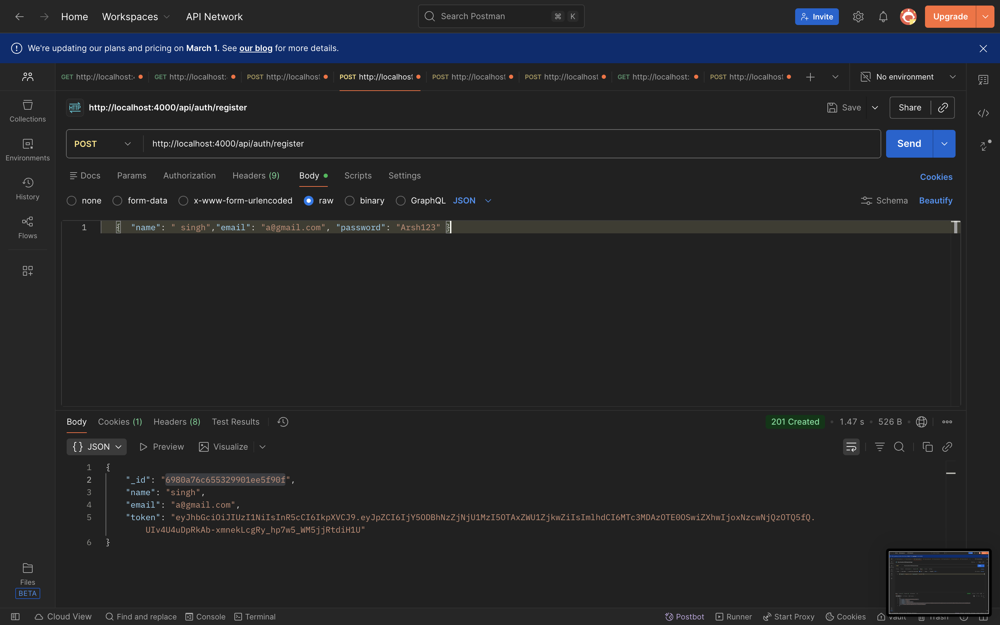 |
| POST /api/auth/login | Login (email, password) | 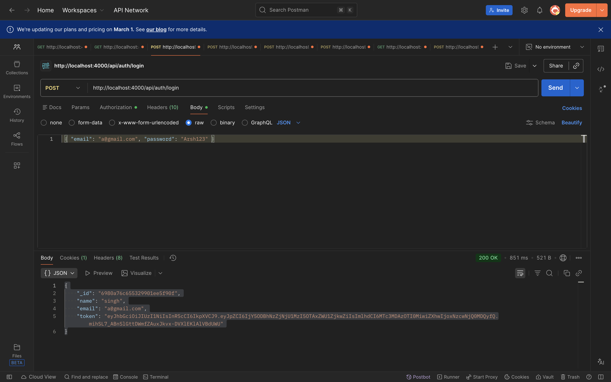 |
| GET /api/auth/me | Current user (protected) | 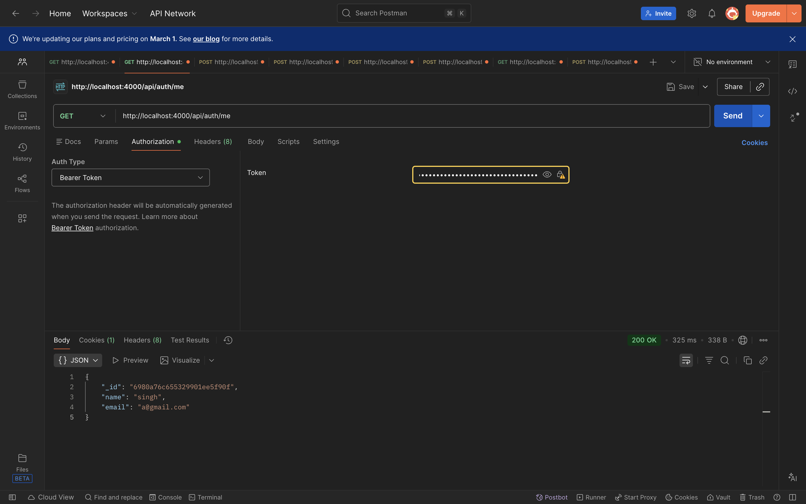 |

#### Courses

| Endpoint | Description | Postman |
|----------|-------------|---------|
| GET /api/courses | List published courses | 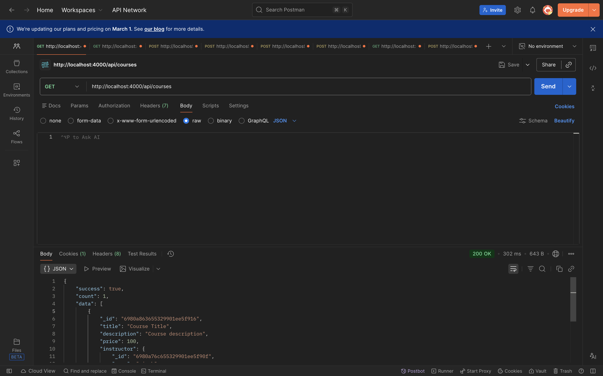 |
| POST /api/courses | Create course (teacher) |  |

#### Subscribe

| Endpoint | Description | Postman |
|----------|-------------|---------|
| POST /api/subscribe | Subscribe to course (courseId, promoCode) | 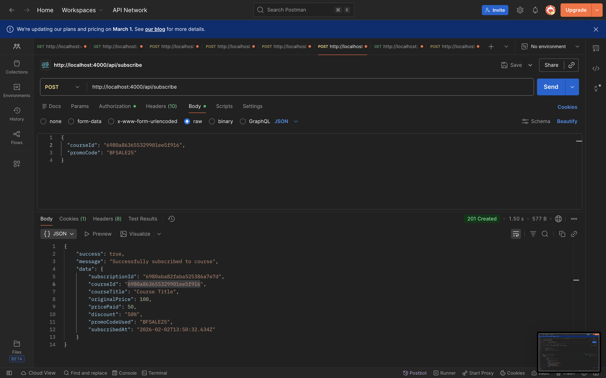 |
| GET /api/subscribe/my-courses | My enrolled courses | 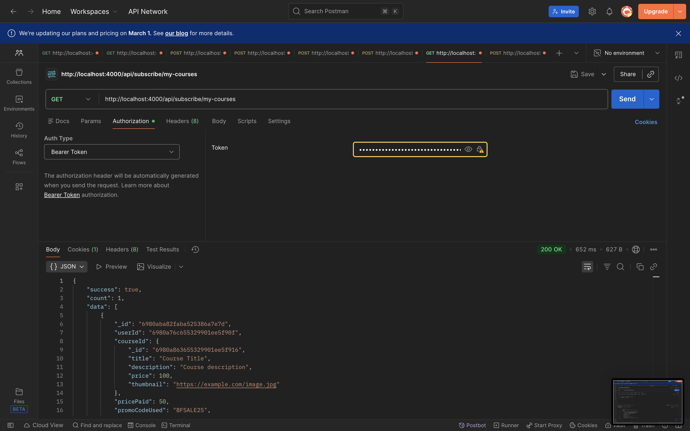 |
| POST /api/subscribe/validate-promo | Validate promo code | 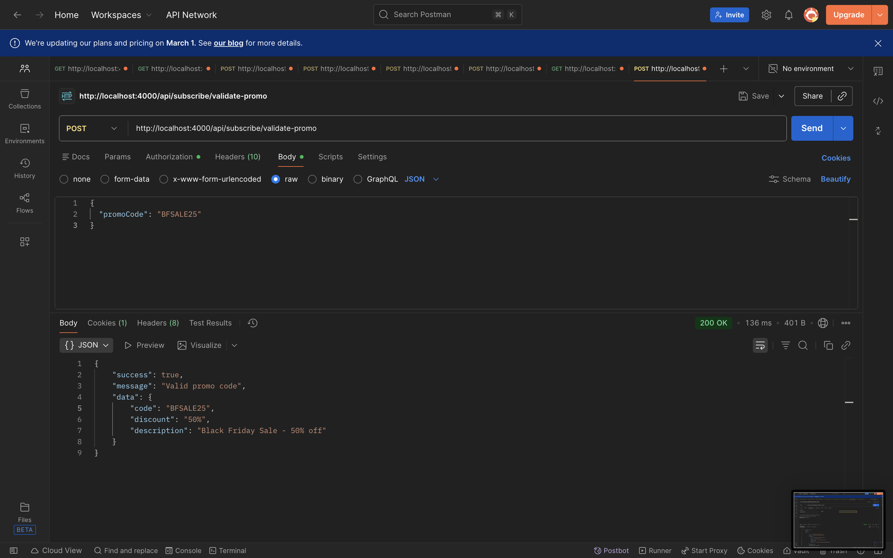 |

---

## Deployment

- **Backend:** Set `NODE_ENV=production`, configure `ALLOWED_ORIGINS`, then run `node server.js` (or use a process manager). For file storage in production, set S3/CloudFront env vars.
- **Frontend:** Set `VITE_API_URL` to your backend API URL, run `npm run build`, and serve the `dist/` folder (e.g. Nginx, Vercel, Netlify).
- **Docker (local dev):** `docker compose -f docker-compose.dev.yml up -d --build` (backend :4000, frontend :5173). Use `backend/.env.docker`.
- **EC2 production:** Copy `backend/.env` to `backend/.env.prod`, set `NODE_ENV=production` and `ALLOWED_ORIGINS=http://YOUR_EC2_IP`. On EC2 run `docker compose up -d --build` (Nginx on port 80; CORS works via same-origin).

---

## License

MIT (or as specified in the project).

---

**MiniCourses** — Course subscription platform with full architecture documented above.
